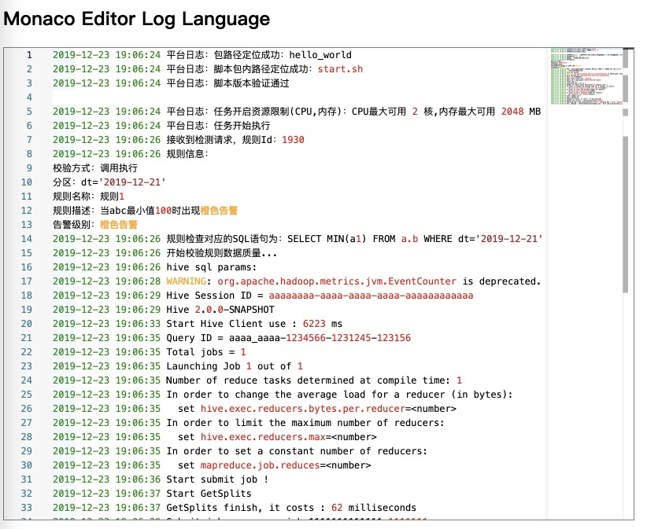

# monaco-language-log
------

Colorization and configuration supports for log languages for the Monaco Editor.



## Demo

https://sumy7.github.io/monaco-language-log/index.html

## How to use

All the code is in the `language-log.js` file.

See `index.html` for more detail.

By change `typeCustomTokenizer`, you could inject token and color schema. The default `typeCustomTokenizer` is:

```javascript
const typeCustomTokenizer = [
    {name: 'orange-alert', regex: '橙色告警', style: {foreground: '#FFA500', fontStyle: 'bold'}},
    {name: 'red-alert', regex: '红色告警', style: {foreground: '#FF0000', fontStyle: 'bold'}}
];
```

# Support log tokens

+ Trace/Verbose/Debug/Info/Warning/Error
+ Date/Time
+ Git commit hashes
+ Guids
+ number/true/false/null
+ String
+ Exception stack
+ url
+ file name with extensions
